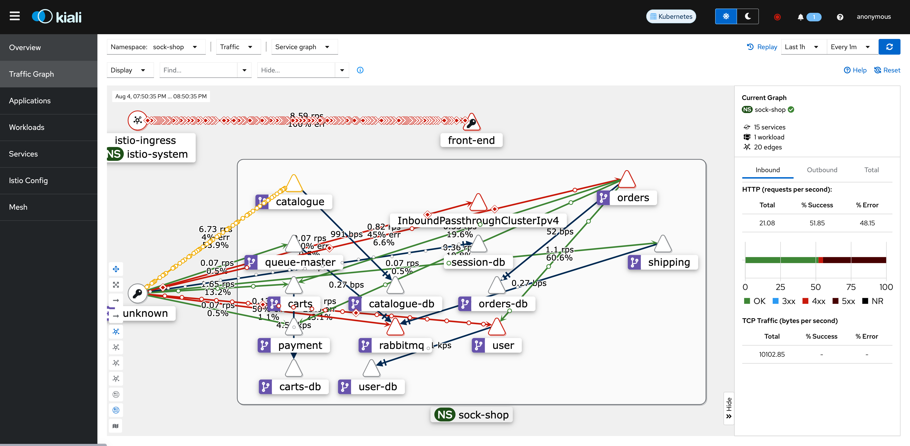

# Baynet - Bayesian Networks

Vamos utilizar uma lib do python pgmpy que tem um pacote com redes bayesianas dinâmicas. Pelo fato da relação entre os componentes ser extremamente dinâmica, vamos fazer uma arquitetura também dinâmica para que os valores e pesos da rede bayesiana seja modificada de acordo com os eventos.

A seguir vamos explicar como vai funcionar a dinâmica do sistema;


## Arquitetura da Baynet

1. Vamos receber um JSON com informações do treinamento da LLM, sempre que uma ou mais anomalias forem detectadas, isso vai ser enviado para uma fila SQS par que possa ser processada de forma assíncrona. A mensagem enviada pela LLM ao SQS vai conter informações sobre nome do serviço com a anomalia encontrada, o tipo do evento encontrado, timestamp e etc.

2. Com base nas informações do microservice afetado, começaremos a fazer análises nos traces utilizando o Tempo. Lembrando que apenas os traces dos microservices que anomalias foram encontradas vão ser analisadas nessa etapa.

3. Com base nas análises dos traces, os pesos da rede bayesiana serão ajustados de acordo com possíveis erros encontrados em spans ou traces.

4. As relações entre os componentes, que também pode ser alteradas dinamicamente, serão levados em consideração pela Baynet, o Istio vai fornecer todas as informações que precisamos para estabelecer dinamicamente a relação entre os microservicos.

Ao final o sistema vai ser de fornecer uma inferência bayesiana que foi gerada de forma dinâmica de acordo com o comportamento efêmero de um sistema distribuído.


## Endpoints

[Bayesian Networks](structe_plot.html) 

```bash
https://maia-lasdpc.icmc.usp.br/baynet
```

```bash
https://maia-lasdpc.icmc.usp.br/kiali
```




[Istio Dashboard](https://grafana-lasdpc.icmc.usp.br/d/b5ee5ce8-c0fe-4bd8-a4c9-4230885558e0/istio-service-dashboard?orgId=1&refresh=1m&var-datasource=prometheus&var-service=payment.sock-shop.svc.cluster.local&var-qrep=source&var-qrep=destination&var-srccluster=All&var-srcns=All&var-srcwl=All&var-dstcluster=All&var-dstns=All&var-dstwl=All&from=now-1h&to=now)