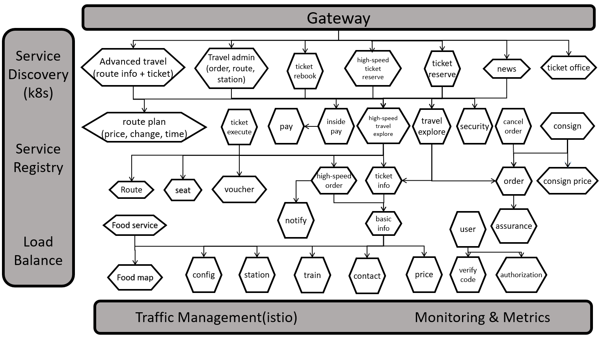

# Train Ticket：A Benchmark Microservice System

The project is a train ticket booking system based on microservice architecture which contains 41 microservices. The programming languages and frameworks it used are as below.
- Java - Spring Boot, Spring Cloud
- Node.js - Express
- Python - Django
- Go - Webgo
- DB - Mongo、MySQL

You can get more details at [Wiki Pages](https://github.com/FudanSELab/train-ticket/wiki).

## Service Architecture Graph


## Quick Start
We provide two options to quickly deploy our application: [Using Docker Compose](#Using-Docker-Compose) and [Using Kubernetes](#Using-Kubernetes).

**Jaeger**

we provide a Tracing System based on [Jaeger](https://www.jaegertracing.io). You can visit the Jaeger Webpage at [http://localhost:16686](http://localhost:16686) to view traces in the system.

### Using Kubernetes
Here is the steps to deploy the Train Ticket onto any existing Kubernetes cluster.

#### Presequisite
* An existing Kubernetes cluster

#### 1. Deploy the train-ticket
```bash
# Deploy the services
kubectl apply -f k8s-deployment/ts-namespace.yml
kubectl apply -f  k8s-deployment/ts-deployment-part1.yml -n train-ticket
kubectl apply -f  k8s-deployment/ts-deployment-part2.yml -n train-ticket
kubectl apply -f  k8s-deployment/ts-deployment-part3.yml -n train-ticket
kubectl apply -f k8s-deployment/trainticket-gateway.yaml -n train-ticket
```

#### 3. Run `kubectl get pods` to see pods are in a ready state

#### 4. Visit the Train Ticket web page at [http://[Node-IP]:32677](http://[Node-IP]:32677).

**Jaeger**

we provide a Tracing System based on [Jaeger](https://www.jaegertracing.io). You can visit the Jaeger Webpage at [http://[Node-IP]:32688](http://[Node-IP]:32688) to view traces in the system.