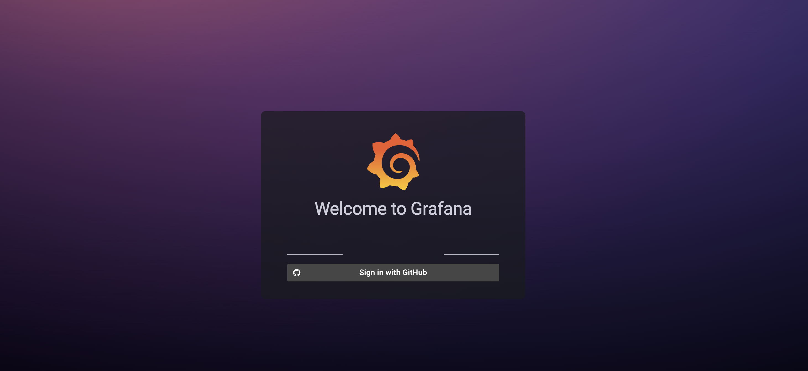
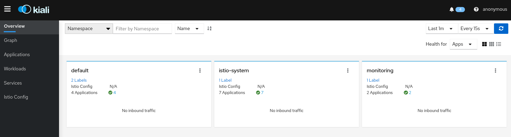

# Metrics Application on AWS EKS


## How to access the EKS Cluster

Example:

```bash
kubectl get nodes

NAME                             STATUS   ROLES    AGE    VERSION
ip-172-20-105-85.ec2.internal    Ready    <none>   161m   v1.19.15-eks-9c63c4
ip-172-20-112-145.ec2.internal   Ready    <none>   162m   v1.19.15-eks-9c63c4
 
```


## Access Granafa and Prometheus

To access the monitoring stack services you need to forward the traffic using kubectl port-forward. There is no public traffic in this setup.

Grafana:

```bash
kubectl port-forward service/grafana 3000:3000 -n monitoring   
```
Prometheus:

```bash
kubectl port-forward service/prometheus-k8s 9090:9090 -n monitoring   
```

Open your browser in localhost:3000



username: admin <p>
password: usp2022 <p>

## Deploy applications using CircleCI


## Cluster Information

**Kubernetes v1.19 + Weave Net addon**

EKS = v1.19<p>
Istio = 

**Monitoring Stack**

kube-prometheus =

**Istio**

Go to the Istio release page to download the installation file for your OS, or download and extract the latest release automatically (Linux or macOS):

```bash
curl -L https://istio.io/downloadIstio | sh -
```

Download the last version:

```bash
curl -L https://istio.io/downloadIstio | ISTIO_VERSION=1.12.2 TARGET_ARCH=x86_64 sh -
```

Move to the Istio package directory. For example, if the package is istio-1.12.2:

```bash
export PATH=$PWD/bin:$PATH
```

For this installation, we use the demo configuration profile. It’s selected to have a good set of defaults for testing, but there are other profiles for production or performance testing.

```bash
istioctl install --set profile=demo -y
```
Add a namespace label to instruct Istio to automatically inject Envoy sidecar proxies when you deploy your application later:

```bash
kubectl --kubeconfig setup/config label namespace default istio-injection=enabled
```

Install istio observability tools:

```bash
kubectl apply -f samples/addons
```

To access the istio observability stack you need to forward the traffic using kubectl port-forward. There is no public traffic in this setup.

Kiali:

```bash
kubectl port-forward service/kiali 20001:20001 -n istio-system   
```

Open your browser in localhost:20001



## References

[1] https://www.weave.works/docs/net/latest/kubernetes/kube-addon/#install <p>
[2] https://istio.io/latest/docs/setup/getting-started/ <p>


