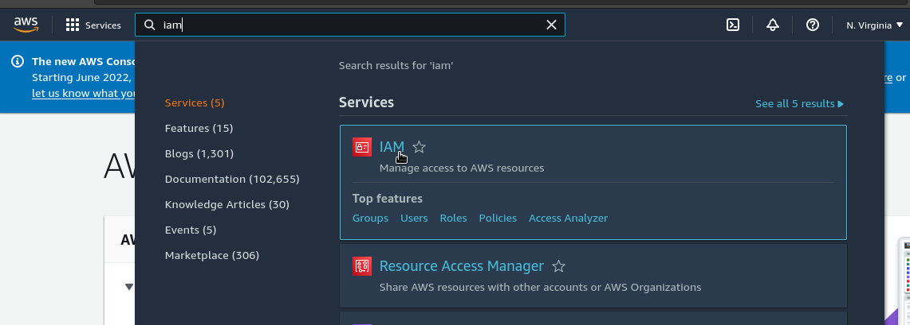
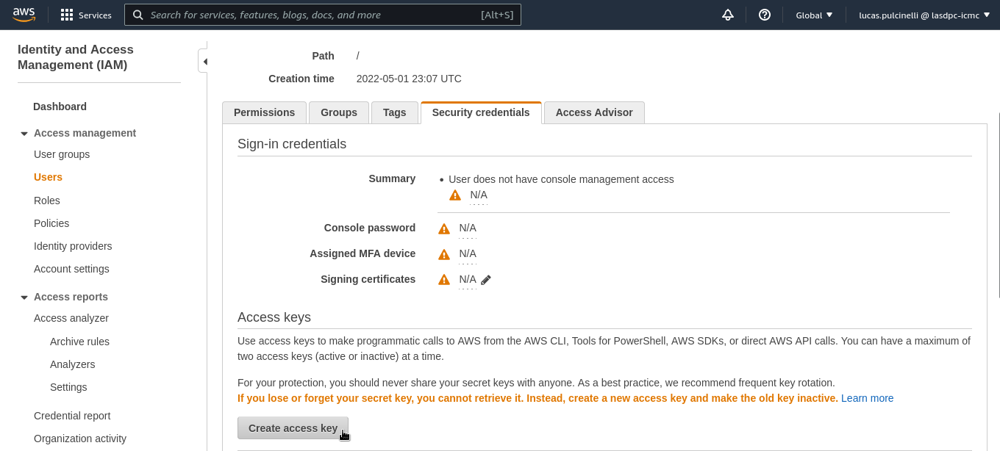

# Metrics Application on AWS EKS


## How to setup awscli

### Download and install
To setup the AWS command line interface, start by downloading the awscli binary (if you are not on linux x86\_64 the command will be different):
```bash
curl "https://awscli.amazonaws.com/awscli-exe-linux-x86_64.zip" -o "awscliv2.zip"
unzip awscliv2.zip
cd aws/
```

After that, install it either in the whole system with `sudo ./install` or only for the current user with `./install -i ~/.local/share/aws-cli -b ~/.local/bin`

### Creating a user access key
To create a access key, go to the [aws site](https://aws.amazon.com/) and log in. In the search bar, search for "iam" (AWS identity and access management)




then, go to "Users" in the left bar, click on your user, and, under "security credentials" / "access keys", click on "create access key"



Save both your key ID and the secret, this is the only time you will be able to see the secret.

### Log in using the aws binary
Log in using your access key and secret via `aws configure`, and select the default region as `us-east-1`, leaving other configurations blank.

## How to access the EKS Cluster
Use `aws eks update-kubeconfig --name prod-application-metrics`, where prod-application-metrics is the name of our cluster, to generate a .kube/config. Then you can use `kubectl` as normal, for example:

```bash
kubectl get nodes

NAME                             STATUS   ROLES    AGE    VERSION
ip-172-20-105-85.ec2.internal    Ready    <none>   161m   v1.19.15-eks-9c63c4
ip-172-20-112-145.ec2.internal   Ready    <none>   162m   v1.19.15-eks-9c63c4
```


## Access Grafana and Loki

To access the monitoring stack services you need to login with Github SS0:

https://grafana-lasdpc.icmc.usp.br/


## Deploy applications using CircleCI


## Cluster Information

**Kubernetes v1.19 + Weave Net addon**

EKS = v1.19<p>
Istio = 1.10

**Monitoring Stack**

kube-prometheus =

**Istio**

Go to the Istio release page to download the installation file for your OS, or download and extract the latest release automatically (Linux or macOS):

```bash
curl -L https://istio.io/downloadIstio | sh -
```

Download the last version:

```bash
curl -L https://istio.io/downloadIstio | ISTIO_VERSION=1.10.0 TARGET_ARCH=x86_64 sh -
```

Move to the Istio package directory. For example, if the package is istio-1.10.0:

```bash
export PATH=$PWD/bin:$PATH
```

For this installation, we use the demo configuration profile. It’s selected to have a good set of defaults for testing, but there are other profiles for production or performance testing.

```bash
istioctl install --set profile=demo -y
```
Add a namespace label to instruct Istio to automatically inject Envoy sidecar proxies when you deploy your application later:

```bash
kubectl label namespace default istio-injection=enabled
```

Install istio observability tools:

```bash
kubectl apply -f samples/addons
```

To access the istio observability stack you need to forward the traffic using kubectl port-forward. There is no public traffic in this setup.

Kiali:

```bash
kubectl port-forward service/kiali 20001:20001 -n istio-system
```

Open your browser in localhost:20001


## References

[1] https://docs.aws.amazon.com/cli/latest/userguide/getting-started-install.html <p>
[2] https://www.weave.works/docs/net/latest/kubernetes/kube-addon/#install <p>
[3] https://istio.io/latest/docs/setup/getting-started/ <p>
